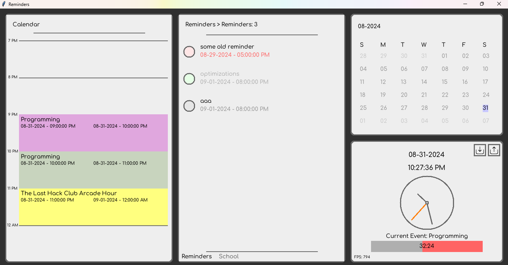

# reminder

because i forgot

## Note:

Reminder just had its first release! It's very likely that a random bug may show up, so please report any bugs or crashes in the issues tab!

## Goal:

Issue: idk

Ok, time to get started!

## Images:

You can find a video of it [here!](https://www.youtube.com/watch?v=wlv_ZfiJgvk)

### Getting Started:

First, make sure you installed all the neccesary python modules! (Any modules that don't come with python are listened down below!) Next, either clone this repository, or get the latest release from the releases tab, and run [`main.py`](/main.py)! Check [`MANUAL.md`](/MANUAL.md) for some tips of how to use this, and check [`CODEGUIDE.md`](/CODEGUIDE.md) if you're interested in the code!

### Modules Used (that dont come with python):
- numpy
- PIL (Pillow)